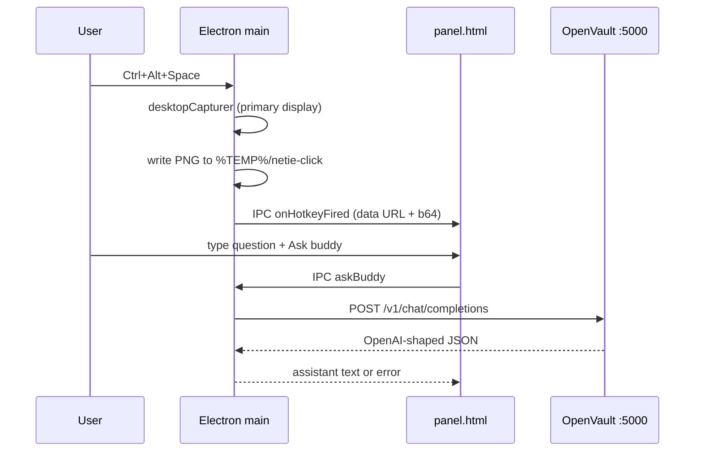

# Netie Click — architecture

Week-1 MVP mapping from MIT Clicky (`vendor/clicky`) to OpenVault-backed Electron on Windows.

## End-to-end flow

## Clicky Swift → Netie Click Electron

| MIT Clicky (`leanring-buddy/`) | Netie Click | Status |
|--------------------------------|-------------|--------|
| `leanring_buddyApp.swift` | `electron/main.js` (`app.whenReady`, tray-only) | MVP |
| `MenuBarPanelManager.swift` | `createTray()`, `createPanelWindow()` | MVP |
| `CompanionPanelView.swift` | `electron/panel.html` + `panel.js` | MVP |
| `CompanionManager.swift` | Hotkey handler + capture state in `main.js` | MVP |
| `ClaudeAPI.swift` | `askOpenVault()` in `main.js` | MVP (OpenVault proxy, not Anthropic direct) |
| `worker/src/index.ts` `/chat` | `POST http://127.0.0.1:5000/v1/chat/completions` | Replaced |
| `worker/src/index.ts` `/tts` | — | Deferred |
| `worker/src/index.ts` `/transcribe-token` | — | Deferred |
| `AssemblyAI*.swift`, `BuddyDictation*.swift` | — | Deferred (mic / PTT) |
| `ElevenLabsTTSClient.swift` | — | Deferred |
| `OverlayWindow.swift`, blue cursor / POINT tags | — | Deferred |
| `ScreenCaptureKit` pipeline | `desktopCapturer.getSources` | MVP (primary display) |
| `GlobalPushToTalkShortcutMonitor` | `globalShortcut.register` | MVP (fixed chord) |

## IPC surface (`preload.js`)

| Renderer API | Main handler | Purpose |
|--------------|--------------|---------|
| `captureNow()` | `click:captureNow` | Manual recapture |
| `askBuddy({ message, screenshot_b64 })` | `click:askBuddy` | Vision chat via OpenVault |
| `getAppInfo()` | `click:getAppInfo` | Hotkey, API URL, version |
| `onHotkeyFired(cb)` | event `click:onHotkeyFired` | Hotkey pushed capture to panel |

## Security

- `contextIsolation: true`, `nodeIntegration: false`, `sandbox: true` on the panel.
- CSP `connect-src` limited to `'self'` and `http://127.0.0.1:5000` (mirrored in `session.webRequest` headers).
- No API keys in the Electron app; OpenVault vault + fallback chain own credentials.

## Patterns borrowed from OpenVault shell

From `apps/shell/electron/main-openvault.js`:

- Single-instance lock (`requestSingleInstanceLock`)
- Tray + `skipTaskbar` floating UI
- CSP via `session.defaultSession.webRequest.onHeadersReceived`
- `showInactive()` where available to reduce focus steal

`processTree.js` is not wired in MVP (Click does not spawn child servers).

## Deferred (post week-1)

1. **Overlay + `[POINT:x,y:label:screenN]`** — parse model output, animate cursor across monitors (`OverlayWindow.swift` equivalent).
2. **AssemblyAI** — streaming transcription + `/transcribe-token` worker route.
3. **ElevenLabs TTS** — `/tts` proxy route and audio playback.
4. **Multi-monitor** — per-display capture, cursor fly target screen index.
5. **Push-to-talk** — global PTT chord, mic permission, waveform UI.
6. **Configurable hotkey** — settings UI + persisted accelerator.
7. **macOS Electron** — dock hide, template tray icon, Screen Recording permission UX.
8. **Packaged installer** — code signing, auto-start, custom tray asset under `apps/click/assets/`.

## Open questions

- Anthropic-native messages through OpenVault (`proxy.py` currently skips `anthropic` for `/v1` shape) — vision MVP assumes an OpenAI-compatible vision provider in the fallback pool.
- Streaming replies (`stream: true`) — OpenVault returns 400 today; panel uses non-streaming only.
